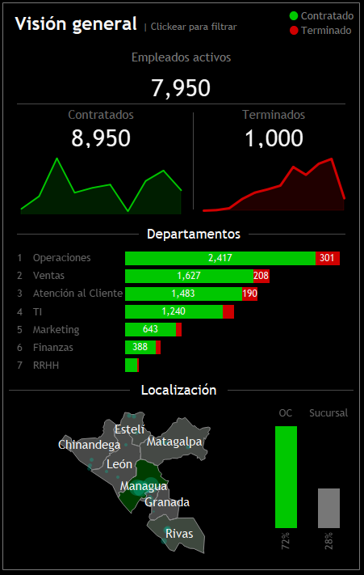
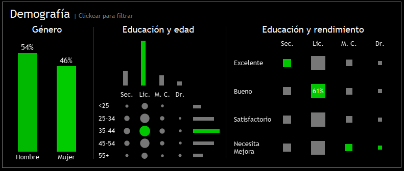
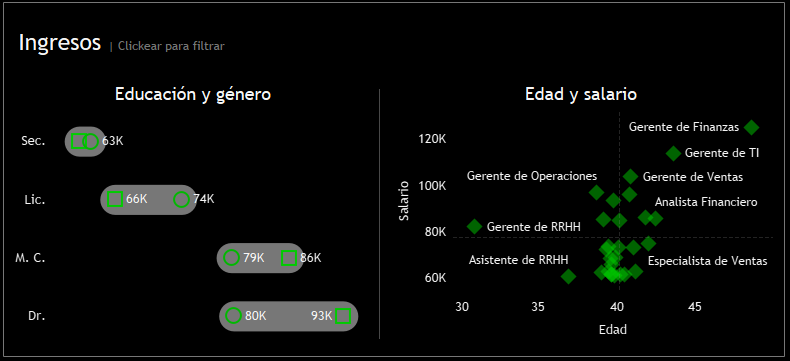

# Análisis de RRHH en una compañía de Nicaragua

## Antecedentes y visión general

ViaNica Cargo (VNC), fundada en 2015, proporciona soluciones logísticas integrales, que incluyen 
la gestión de inventarios, coordinación del transporte y optimización de la cadena de suministro. Tiene 
distintas fábricas y centros de distribución a lo largo de varios ciudades de Nicaragua, facilitando 
el acceso a mercados tanto nacionales como internacionales. VNC es reconocida como una empresa que 
provee excelencia operativa y satisfacción del cliente.

La empresa ha recopilado cantidades masivas de información de sus RRHH. Este proyecto analiza 
detalladamente esa información para optimizar la gestión de sus RRHH y mejorar la eficiencia operativa.

Los descubrimientos  y recomendaciones son proporcionadas en las siguientes áreas claves:

- Análisis general: Provee métricas como el número total de empleados, empleados activos, empleados terminados, etc.
- Análisis demográfico: Ofrece métricas en la composición de la fuerza de trabajo.
- Análisis de ingresos: Ofrece métricas relacionadas al salario de la fuerza de trabajo.

Los resultados son presentados a través de dos dashboards que facilita la toma de decisiones de la 
compañía al entender de una mejor manera sus RRHH. El primer dashboard provee una vista general 
de los RRHH, mientras que el otro lo hace a nivel específico. Los datos fueron generados de 
manera sintética usando la librería Faker de Python.

## Estructura de datos y exploraciones iniciales

NicaTex tiene 8,950 observaciones, cada uno representando un empleado de la compañía, incluyendo activos y terminados desde la creación de la compañía. Contiene 
15 columnas con información de los recursos humanos de NicaTex, incluyendo: 

| **Columna**               | **Propósito**                                                                                      |
|---------------------------|---------------------------------------------------------------------------------------------------|
| id_empleado               | Identificador único asignado a cada empleado para facilitar el seguimiento y la gestión de datos |
| nombre                    | Nombre del empleado, utilizado para la identificación personal y en comunicaciones internas     |
| apellido                  | Apellido del empleado, complementa el nombre para una identificación completa                    |
| género                    | Indica el género del empleado, importante para análisis demográficos y de diversidad            |
| provincia                 | Provincia donde reside el empleado, útil para análisis geográficos y de distribución de personal|
| ciudad                    | Ciudad específica de residencia del empleado, permite un análisis más detallado a nivel local   |
| fecha_contratación        | Fecha en que el empleado fue contratado, esencial para calcular la antigüedad y beneficios      |
| departamento              | Área o sección en la que trabaja el empleado, importante para la organización interna del banco |
| puesto_trabajo            | Título del trabajo o función que desempeña el empleado, clave para la gestión de roles y responsabilidades |
| nivel_educación           | Grado educativo alcanzado por el empleado, relevante para evaluar la idoneidad para ciertos puestos |
| salario                   | Remuneración del empleado, fundamental para análisis de costos laborales y presupuestos         |
| calificacion_desempeno    | Evaluación del rendimiento laboral del empleado, utilizada para decisiones sobre promociones y formación |
| horas_extra               | Número de horas trabajadas fuera del horario regular, útil para calcular compensaciones adicionales |
| fecha_nacimiento          | Fecha de nacimiento del empleado, necesaria para cálculos de edad y beneficios relacionados con la jubilación |
| fecha_terminacion        | Fecha en que finalizó la relación laboral con el empleado, importante para análisis de rotación y desvinculación |

## Resumen ejecutivo

### Visión general de descubrimientos

NicaTex ha tenido 8,950 empleados, de esos, 7950 son activos, 1000 están terminados.  La mayoría de las contrataciones se dieron en 2017. Mientras
que las terminaciones en 2024. El departamento de operaciones es donde la mayoría de empleados trabajan. Managua es el departamento con la mayor
concentración de fuerza de trabajo. Un poco más de la mitad de la fuerza de trabajo es del sexo masculino, se encuentran en un rango de edad entre 35 a 44
años. Los empleados masculinos ganan más en promedio que sus contrapartes femeninas en cada nivel de educación. Los salarios aumentan con la edad y experiencia. Abajo se ve el primer
dashboard que ofrece una visión general. El dashboard interactivo completo puede ser explorado [aquí](https://public.tableau.com/views/Dashboard_RRHH_17280788056620/RRHHResumen?:language=en-US&publish=yes&:sid=&:redirect=auth&:display_count=n&:origin=viz_share_link).

### Análisis general

- La compañía ha tenido 8,950 empleados, 7950 están activos y 1000 terminados. La mayoría de empleados que están actualmente activos fueron contratados en 2017, representando un 17% (1,506).
En tiempos de pandemia se contrató menos personal que esta actualmente activo que en otros años. Ellos representan un 5% (422). La mayoría de exempleados tuvieron su terminación en este año,
representado un 19% (192).

- El departamento con mayor fuerza laboral es la de operaciones con 2,947 (27%) empleados activos.

- La mayoría de empleados son originarios del departamento de Managua (6270) y en específico del municipio de Ciudad Sandino (2100).

- La mayoría de empleados trabaja en la oficina central en Managua, representando un 72% (6,270) de la fuerza laboral.

### Análisis demográfico

- La fuerza laboral está compuesta en un poco más de la mitad (54%) por hombres, conteniendo 4,801 empleados de ese sexo.

- Más de la mitad de la fuerza laboral (61%) posee una licenciatura, representando 5,418 empleados.

- Un poco más de un tercio de los empleados (31%), tiene entre 35 a 44 años, representando 2,765 empleados.  

- Más de la mitad de la fuerza laboral (60%) está en el rango de edad que va de 35 a 44 años y tiene una licenciatura, representando 1,652 empleados.

- Los empleados con licenciatura son el grupo que posee mejores rendimientos en las diferentes escalas de mediciones.

### Análisis de ingresos

- Los empleados de sexo masculino ganan un 8.27 % más en promedio a lo largo de cada nivel de educación. Esto significa que los hombres
ganan en promedio C$ 79,500 y las mujeres C$ 73,500.

- Hay una correlación positiva entre la edad y el salario del empleado en su puesto de trabajo. Su salario aumenta conforme escala en los diferentes puestos de
su departamento específico. 

## Recomendaciones y pasos futuros

Estas son las recomendaciones basadas en los resultados obtenidos:

- Análisis de causas de terminación: Se debe determinar la causa detrás del hecho que el 19% de los empleados han terminado su relación laboral este año.

- Programas de retención: Crear e implementar programas de retención a los empleados contratados en 2017, ya que representan un porcentaje sginificativo de la fuerza laboral activa. Se podría ofrecer incentivos u oportunidades de progreso en posiciones dentro de la empresa.

- Expansión geográfica: Dado que el 72% de los empleados se concentra en Managua, explorar oportunidades para diversificar la fuerza laboral en otras regiones podría ser beneficioso. Esto no solo puede reducir la dependencia de una única ubicación, sino también abrir nuevas oportunidades comerciales.

- Programas de capacitación continua: Con un 61% de empleados con licenciatura, es crucial ofrecer programas de capacitación continua que les permitan avanzar en sus carreras y mejorar sus habilidades. Esto puede incluir cursos relacionados con sus áreas específicas o habilidades blandas como liderazgo y trabajo en equipo.

- En el futuro se propía hacer uso de análisis predictivos para prever la rotación de personal, o usarlo para desarrollar una lista de personas que podrían ser promovidas.

Este proyecto es inspirado por el dashboard creado por [Baraa Khatib Sakini en este video](https://www.youtube.com/watch?v=UcGF09Awm4Y).